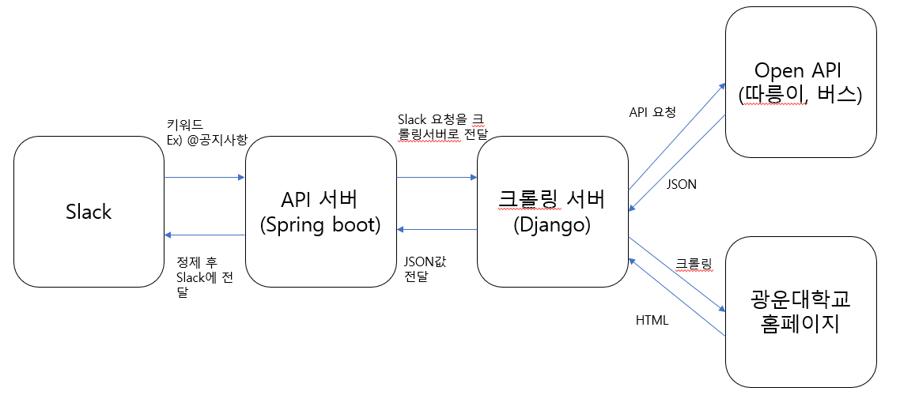

# KwInfoBotAPI

> 광운대학교 각종 정보를 알려주는 봇(Bot) API

* 기능
  * 학교에서 제공해주는 취업정보 알림
  * 학교에서 제공해주는 공지사항 알림
  * 유캠퍼스 공지사항, 강의자료 업데이트 알림
  * 학사일정
  * 따릉이 open API
  * 버스 open API
  * 도서관 자리 정보 알림

## Prerequisites

* Spring boot
* Slack
* Python
* Django

## Architecture

## Requirements

